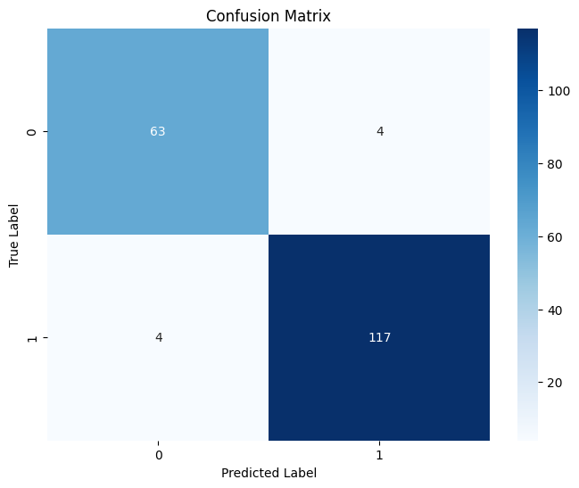
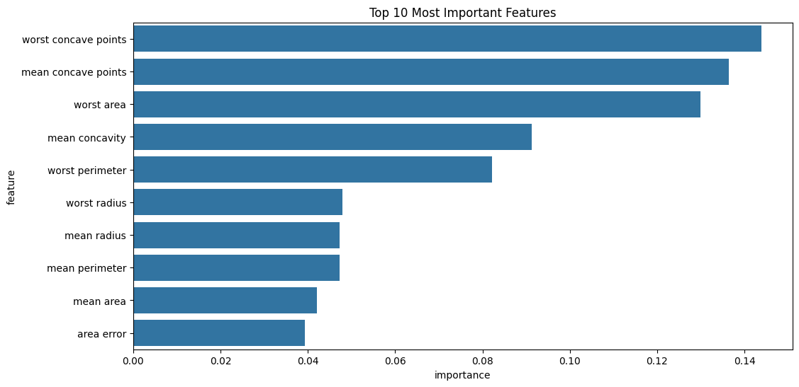

# Cancer Cell Classification Model

This project demonstrates an end-to-end pipeline for classifying breast cancer cells using scikit-learn:

- **Data loading & preprocessing**: StandardScaler on 30 features
- **Model comparison**: Naive Bayes, SVM, Random Forest
- **Hyperparameter tuning**: GridSearchCV on Random Forest
- **Metrics & visualization**: Accuracy, confusion matrix, feature importances

## Demo & Results




**Cross-validation accuracy**: 96.7%  


## Getting Started

```bash
# Clone the repo
git clone https://github.com/<your-username>/<your-repo>.git
cd <your-repo>

# Install dependencies
pip install -r requirements.txt

# Run the model
python CancerCellModel.py
